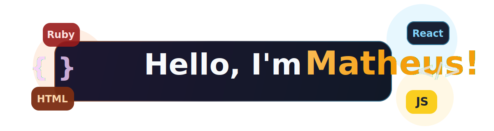

  

  <strong>Full Stack Software Engineer (Backend-Focused) building scalable APIs and distributed systems.</strong>

  Ruby on Rails • React • PostgreSQL • RabbitMQ • GraphQL

  Based in Brazil • Open to Remote Opportunities

  <a href="https://www.linkedin.com/in/matheus-de-oliveira-souza-75b545156/">LinkedIn</a>
  •
  <a href="mailto:matheus.oliveira2018@outlook.com.br">Email</a>

## About Me
Full Stack Software Engineer with 4+ years of experience building production-grade applications with a strong focus on backend engineering.

I specialize in designing REST APIs, working with PostgreSQL, and building reliable systems using event-driven architecture and messaging (RabbitMQ).

My experience includes fintech and insurtech systems, where I worked with payment integrations, complex business rules, and scalable distributed services.

## What I Do
- Design and build scalable backend systems using Ruby on Rails
- Develop and maintain REST and GraphQL APIs
- Work with relational databases (PostgreSQL, MySQL) with performance optimization
- Build frontend interfaces using React based on real product requirements
- Implement event-driven systems using RabbitMQ
- Write clean, maintainable code using TDD, RSpec, and Clean Architecture principles

## Tech Stack

  
  
  
  
  
  
  
  

## Current Focus

- Backend engineering for scalable systems
- Distributed architectures and messaging systems
- International remote opportunities
- Continuous improvement in system design and performance